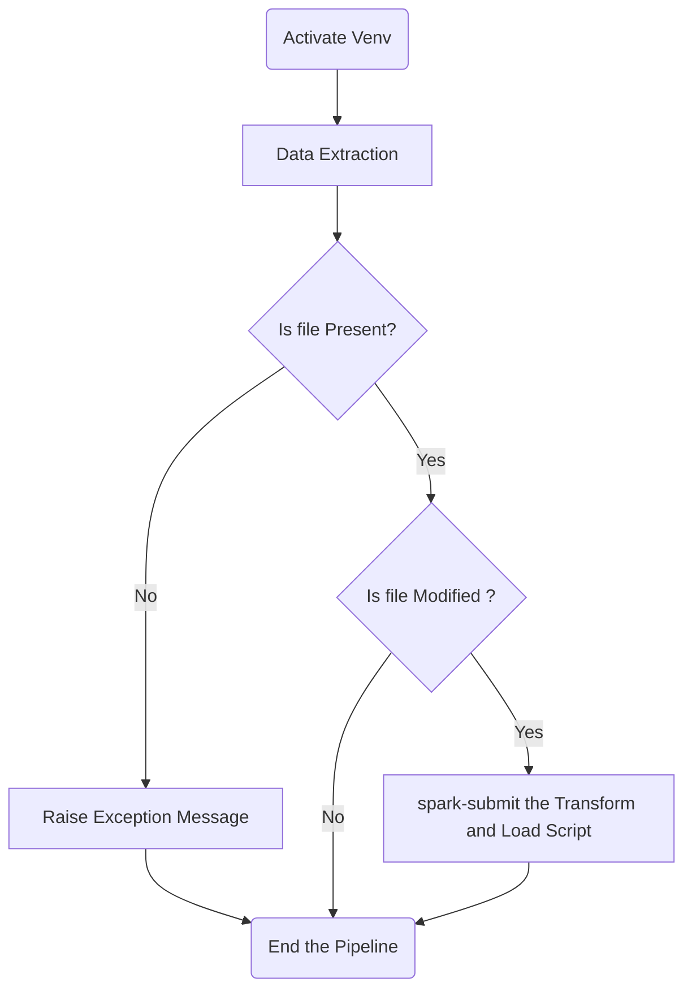

# Stock Market Data Processing and Visualization Pipeline
This project is a comprehensive data pipeline and visualization platform for stock market data. It encompasses data extraction, transformation, and automated data processing using Python, Apache Spark, PostgreSQL, and Apache Airflow. The inclusion of Apache Superset enables powerful data visualization capabilities, offering users the opportunity to gain deep insights into the world of finance. The project empowers users to explore stock performance, correlations, and market dynamics through a wide range of interactive visualizations.
<hr>
<hr>

### Introduction
The data extraction script extracts stock market data and saves it as a Parquet file. It uses a configuration file in YAML format to specify the API token. The script leverages the `requests`, `pandas`, and `yaml` libraries to perform the data extraction and transformation.
The data transformation script processes stock market data and saves it to a PostgreSQL database. It uses Apache Spark and PySpark to perform data transformation, including renaming columns, converting timestamps, and ordering data by date.
The Airflow DAG script automates the execution of a data pipeline. It includes tasks for activating a virtual environment, running data extraction, checking for file changes, and performing data transformation. The DAG integrates with Spark for data processing.

### Data Source
The data source of this work is [Market Data](https://www.marketdata.app/) which provides [API](https://api.marketdata.app) to get Real-Time & Historic Data For Stocks, Options, Crypto, Futures, Forex. Here we take the data of four Stocks, `GOOGL`, `AAPL`,  `AMZN` and `META` as
`GET [v1/stocks/candles/{resolution}/{symbol}]`
and apply ETL and visualization to get some insights.

### Prerequisites
Before using this script, ensure you have the following:
- Python 3.x installed
- Apache Spark installed
- PySpark installed
- PostgreSQL installed and configured
- Apache Airflow installed and configured
- Required Python packages listed in the `requirements.txt` file. You can install them using:
> `pip install -r requirements.txt`


### Configuration
To configure the script, create a YAML file with the following structure and provide the path to the YAML file in the script:
```yaml
token: YOUR_API_TOKEN
postgres:
  url: DATABASE_URL
  user: DATABASE_USER
  password: DATABASE_PASSWORD
```
### Usage

1.  Be sure to set the `yaml_file_path` and `parquet_file_path` or `data_path` variables in the script to the appropriate file paths.
2.  Ensure you have the PostgreSQL driver JAR file in the specified location.
3.  Ensure that Apache Airflow is up and running.
4.  Define and configure the DAG within your Airflow project, as shown in the script.

### Notes

-   The script assumes the necessary environment setup and configurations are in place, including Apache Airflow, Spark, Superset and PostgreSQL.
-   Ensure that file paths and command execution in the DAG are accurate for your environment.

### The Pipeline Flowchart


> A Flowchart showing the ETL Pipeline in DAG file

## Author

>[__Sushan Kattel__](https://www.linkedin.com/in/sushan-kattel/)
[__Prateek Pudasainee__](https://www.linkedin.com/in/prateek-pudasainee-648589239/)
[__Puja Pathak__](https://www.linkedin.com/in/puja-pathak-542b6b219/)

## Mentor
>[__Aman Shah__](https://www.linkedin.com/in/aman-shah-26687b189/)
